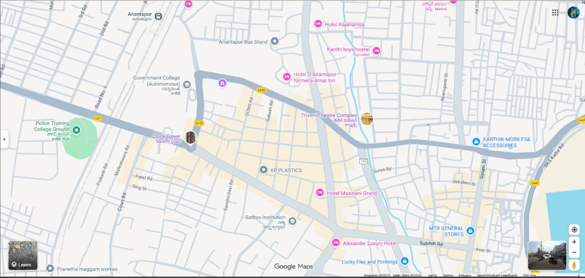
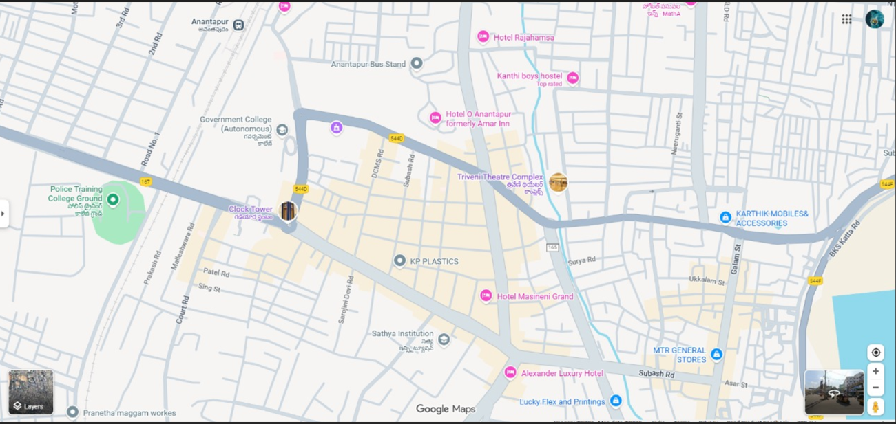
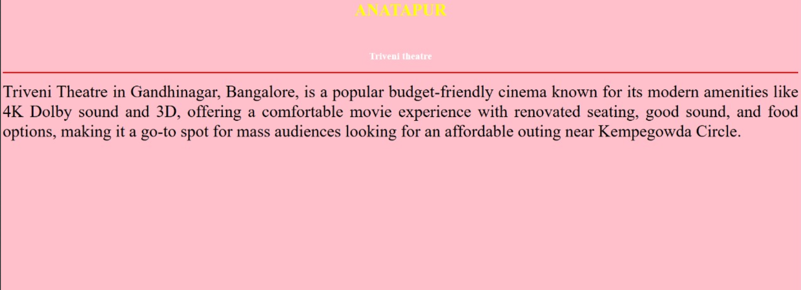
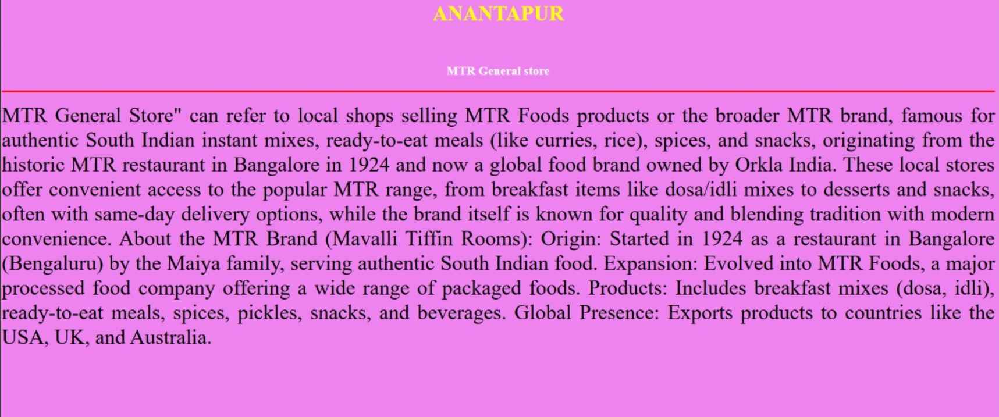
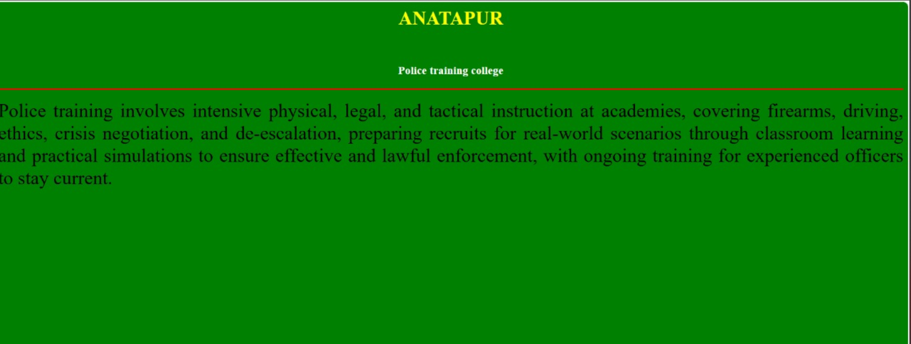
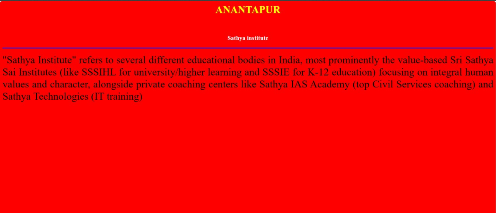

# Ex04 Places Around Me
## Date: 09-12-25

## AIM
To develop a website to display details about the places around my house.

## DESIGN STEPS

### STEP 1
Create a Django admin interface.

### STEP 2
Download your city map from Google.

### STEP 3
Using ```<map>``` tag name the map.

### STEP 4
Create clickable regions in the image using ```<area>``` tag.

### STEP 5
Write HTML programs for all the regions identified.

### STEP 6
Execute the programs and publish them.

## CODE
map.html
```
<html>
    <head>
        <title>NearMe</title>
    </head>
    <body>
        <header>
            <h1 align="center">ANATAPUR</h1>
            <br>
            <h4 align="center">NEELI DARSHINI(25004961)</h4>
        </header>
        

<map name="image-map">
    <area target="" alt="Govt.college" title="Govt.college" href="college.html" coords="374,207,577,313" shape="rect">
    <area target="" alt="Triveni theatre" title="Triveni theatre" href="movie.html" coords="968,351,91" shape="circle">
    <area target="" alt="MTR General store" title="MTR General store" href="store.html" coords="1253,616,1411,635,1411,717,1331,715,1256,709" shape="poly">
    <area target="" alt="Police training college" title="Police training college" href="training.html" coords="149,378,104" shape="circle">
    <area target="" alt="Sathya institute" title="Sathya institute" href="institute.html" coords="680,637,689,683,737,708,816,712,907,659,799,593,741,588,695,617" shape="poly">
</map>
        
    </body>
</html>
```
```
college.html
<html>
    <head>
        <title></title>

    </head>
    <body bgcolor="blue">
        <h1 align="center">
            <font color="yellow"><b>ANANTAPUR</b></font>
        </h1>
        <br>
        <h3 align="center">
            <font color="white"><b>Govt.college</b></font>
        </h3>
        <hr size="3" color="pink">
        <p align="justify">
            <font size="6">
               A Government College (Autonomous) is a state-funded higher education institution given freedom by the government to design its own syllabi, conduct exams, and manage finances, while still adhering to basic government regulations, offering specialized, quality education beyond standard university patterns, with specific examples like Presidency College (Autonomous) in Chennai or Government College (Autonomous) in Angul. They focus on innovation, industry-alignment, and holistic student development, differentiating from fully government-controlled colleges by their academic independence. 
Key Features of Government Autonomous Colleges:
Academic Freedom: Design their own curriculum, choose textbooks, and set exam patterns, leading to more relevant and updated courses.
Financial & Operational Autonomy: Manage their own budgets, staff appointments, and daily operations.
Government Funding:

        </p>
    </body>
</html>
```
```
movie.html
<html>
    <head>
        <title></title>

    </head>
    <body bgcolor="pink">
        <h1 align="center">
            <font color="yellow"><b>ANATAPUR</b></font>
        </h1>
        <br>
        <h3 align="center">
            <font color="white"><b>Triveni theatre</b></font>
        </h3>
        <hr size="3" color="red">
        <p align="justify">
            <font size="6">
                Triveni Theatre in Gandhinagar, Bangalore, is a popular budget-friendly cinema known for its modern amenities like 4K Dolby sound and 3D, offering a comfortable movie experience with renovated seating, good sound, and food options, making it a go-to spot for mass audiences looking for an affordable outing near Kempegowda Circle. 
        </p>
    </body>
</html>
```
```
store.html
<html>
    <head>
        <title></title>

    </head>
    <body bgcolor="violet">
        <h1 align="center">
            <font color="yellow"><b>ANANTAPUR</b></font>
        </h1>
        <br>
        <h3 align="center">
            <font color="white"><b>MTR General store</b></font>
        </h3>
        <hr size="3" color="red">
        <p align="justify">
            <font size="6">
                MTR General Store" can refer to local shops selling MTR Foods products or the broader MTR brand, famous for authentic South Indian instant mixes, ready-to-eat meals (like curries, rice), spices, and snacks, originating from the historic MTR restaurant in Bangalore in 1924 and now a global food brand owned by Orkla India. These local stores offer convenient access to the popular MTR range, from breakfast items like dosa/idli mixes to desserts and snacks, often with same-day delivery options, while the brand itself is known for quality and blending tradition with modern convenience. 
About the MTR Brand (Mavalli Tiffin Rooms):
Origin: Started in 1924 as a restaurant in Bangalore (Bengaluru) by the Maiya family, serving authentic South Indian food.
Expansion: Evolved into MTR Foods, a major processed food company offering a wide range of packaged foods.
Products: Includes breakfast mixes (dosa, idli), ready-to-eat meals, spices, pickles, snacks, and beverages.
Global Presence: Exports products to countries like the USA, UK, and Australia.


         </font>
        </p>
    </body>
</html>
```
```
training.html
<html>
    <head>
        <title></title>

    </head>
    <body bgcolor="green">
        <h1 align="center">
            <font color="yellow"><b>ANATAPUR</b></font>
        </h1>
        <br>
        <h3 align="center">
            <font color="white"><b>Police training college</b></font>
        </h3>
        <hr size="3" color="red">
        <p align="justify">
            <font size="6">
                Police training involves intensive physical, legal, and tactical instruction at academies, covering firearms, driving, ethics, crisis negotiation, and de-escalation, preparing recruits for real-world scenarios through classroom learning and practical simulations to ensure effective and lawful enforcement, with ongoing training for experienced officers to stay current. 
        </p>
    </body>
</html>
```
```
institute.html
<html>
    <head>
        <title></title>

    </head>
    <body bgcolor="red">
        <h1 align="center">
            <font color="yellow"><b>ANANTAPUR</b></font>
        </h1>
        <br>
        <h3 align="center">
            <font color="white"><b>Sathya institute</b></font>
        </h3>
        <hr size="3" color="blue">
        <p align="justify">
            <font size="6">
                "Sathya Institute" refers to several different educational bodies in India, most prominently the value-based Sri Sathya Sai Institutes (like SSSIHL for university/higher learning and SSSIE for K-12 education) focusing on integral human values and character, alongside private coaching centers like Sathya IAS Academy (top Civil Services coaching) and Sathya Technologies (IT training)
         </font>
        </p>
    </body>
</html>
```
```


## OUTPUT









## RESULT
The program for implementing image maps using HTML is executed successfully.
